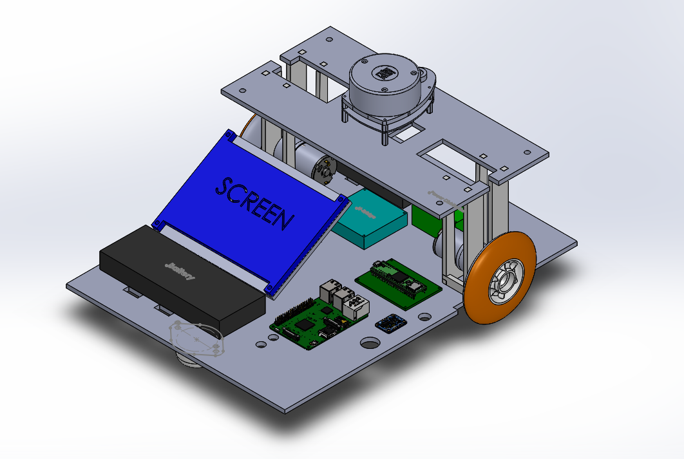
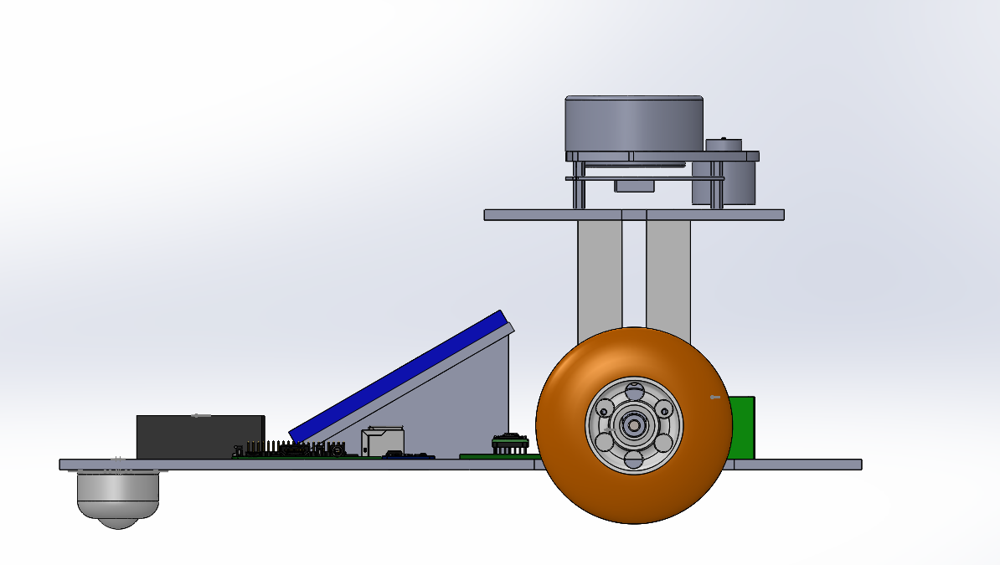

# Indoor Autonomous Navigation System Chassis

This repository contains the design for an indoor autonomous navigation system; specifically a small two wheeled robot equipped with LIDAR and several other sensors. Using a mobile phone control panel, users are able to direct the robot around a predetermined map. Shown below are screenshots of the SolidWorks design of the robot.

## Isometric View

## Side View

